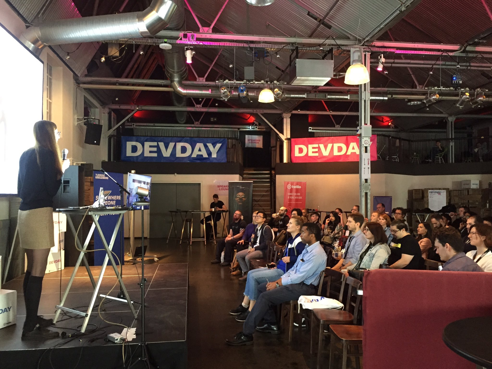
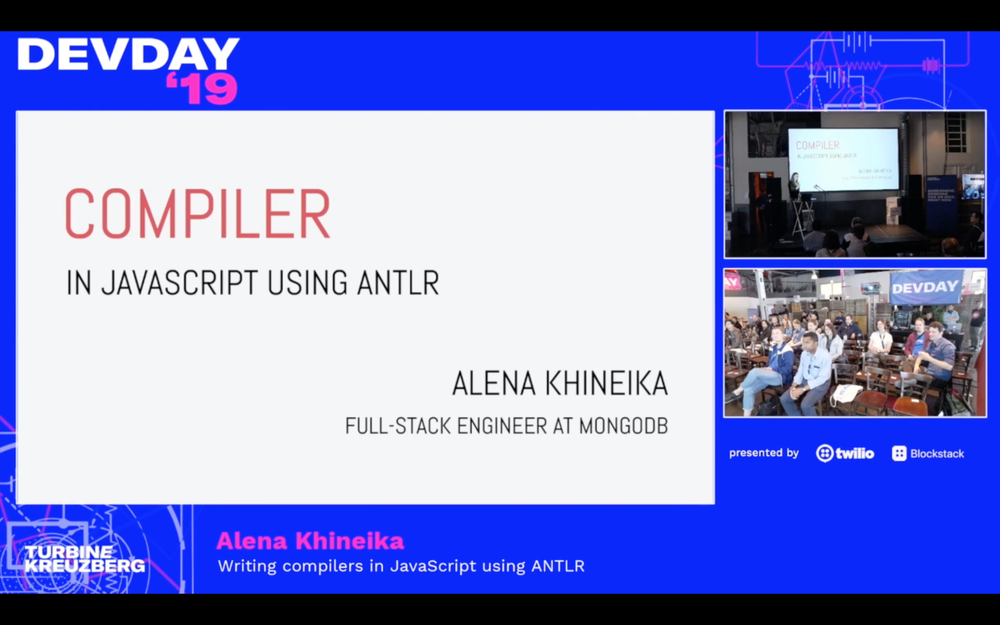

# Compiler in JavaScript using ANTLR v2

[DEV DAY](https://devday.io/) conference, 25.05.2019

There are plenty of options if you need to translate one language into another (e.g. English to German). But what about programming languages? Is it possible to translate JavaScript to Python? Is there any way to customize this process? Where should you start?

Let's talk about language compilers and basic principles behind it. It sounds a bit scientific, but it can also be very interesting and probably significantly different from your routine programming tasks.

Check out [slides](./devday-slides.pdf) from the talk and the [recordin](https://www.youtube.com/watch?v=-Gtsh9VlycI).

